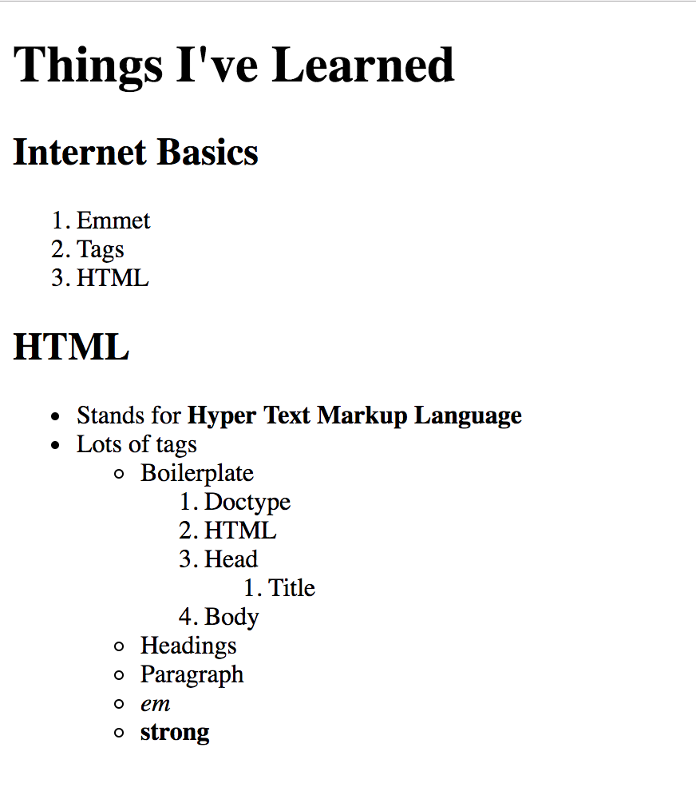
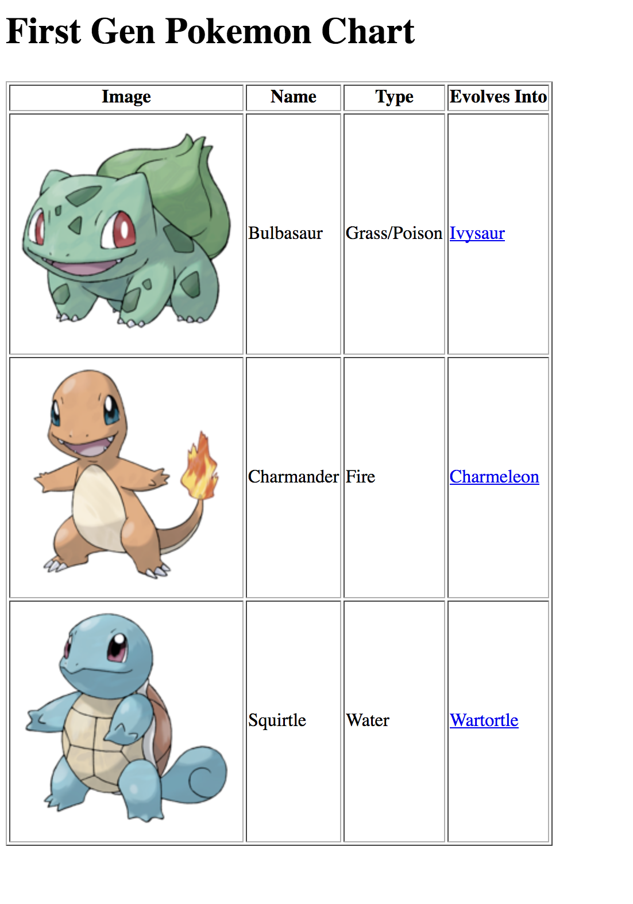
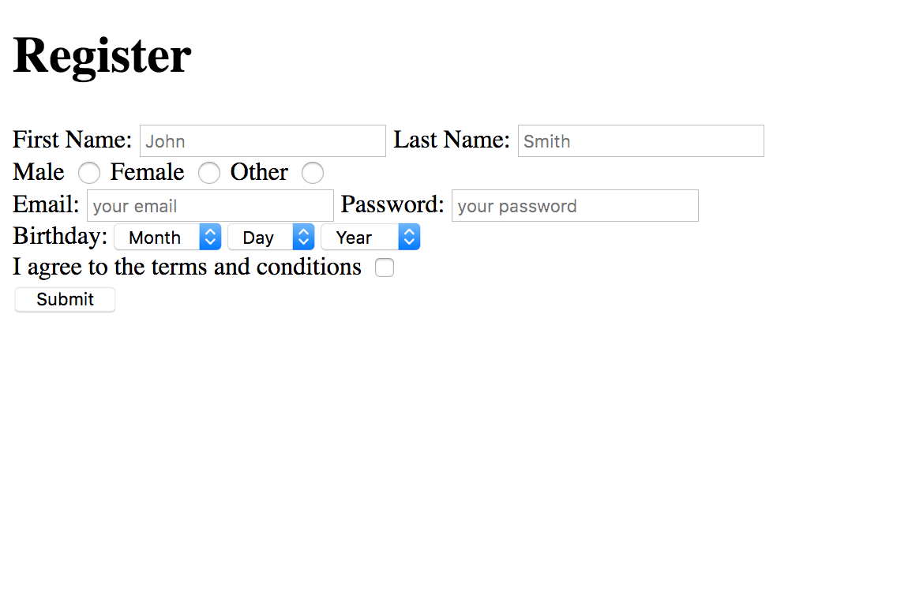

# Learn-HTML
* Recreate page structure using HTML tags

## Exercise 1
* Headings used are `h1` and `h2`
* Notice the `i` and `strong` tags

## Exercise 2
* Get an image that you like from [unsplash](https://unsplash.com/)
* Display it on the web page

## Exercise 3
* Use the data provided in `data.txt` for this exercise

## Exercise 4
* The form has no action. Focus on the structure of the html using the proper tags
* first name, last name, email and password are `REQUIRED` fields
* Password should have `5-10` characters (Hint! google to find out how to implement this. No JS!)
